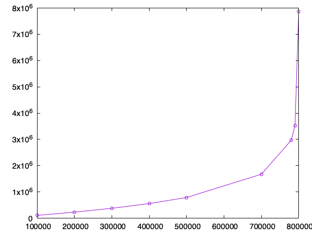
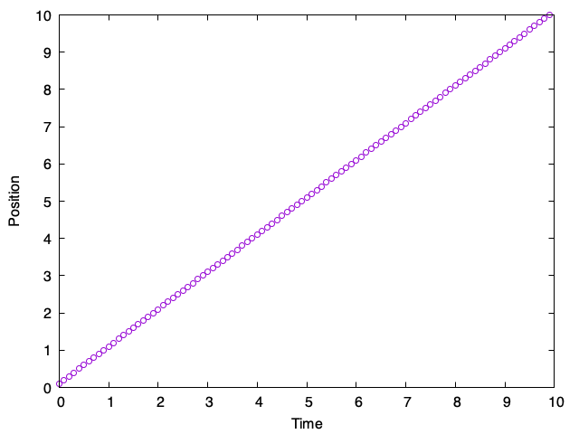

# 数値計算の基礎

* なぜ数値計算が必要なのか？
* 数値実験とはどのような実験か？
* 数値計算の種類
* 単位とスケーリング

## 数値シミュレーションとは

シミュレーションとは、あるルールに従う系の振る舞いを再現、予想することだ。例えば、運転免許を取得する際、ドライブシミュレータを利用した人もいるだろう。ドライブシミュレータは、「ハンドルを切ると曲がり、アクセルを踏むと加速する」といったルールに従って、「もしこのような運転を行ったらどんな結果になるだろうか？」という振る舞いを予想するためのツールだ。同様に、飛行機のパイロットは、計器や操縦桿が実機と同じ場所に配置されているフライトシミュレータを使って訓練する。フライトシミュレータを使えば、現実ではなかなか起きない悪天候での飛行訓練や、エンジン停止など、現実に実施すると危険なアクシデントへの対応を訓練することができる。このシミュレーションを数値的に行うのが数値シミュレーションだ。世の中には様々な数値シミュレーションが存在するが、数値シミュレーションを用いて科学を研究するのが計算科学という分野だ。本講義では計算科学に用いられる数値シミュレーションについて扱う。

あるルールに従う系の振る舞いを再現、予想するのがシミュレーションであるから、数値シミュレーションとは、あるルールに従う系の振る舞いを **数値的に** 再現、予想するものだ。コンピュータが計算を実施するためには、そのルールはコンピュータがわかる形で厳密に定められていなければならない。あらかじめルールが分かっているのに、そのルールにしたがって何か系が時間発展した結果を「予想」するとはどういうことだろうか？一つ、簡単な例を挙げよう。

リボ払い、という仕組みを聞いたことがあるだろう。借金を毎月一定額ずつ返済する仕組みだ。返済方法は「残高スライド方式」と「定額方式」の二通りがあるが、ここでは仕組みが簡単な「定額方式」を考える。定額方式は、残高にかかわらず毎月の返済額を固定する仕組みだ。この支払額には金利手数料が含まれており、毎月の支払額から金利手数料を除いた額だけ借入残高が減っていく。

例えば、金利15%で、10万円を借りて、毎月1万円の定額方式で返済することを考える。毎月の金利手数料は日割りで計算するが、簡単のため、毎月の金利を1年の金利の12分の1としよう。すると、最初の支払いは以下のように計算される。

まず、月の金利は、15%の1/12、つまり1.25%だ。残高が10万円なので、金利手数料はその1.25%である1250円である。毎月の支払いは1万円で固定なので、残りの8750円だけ残高が減ることになる。2回目の支払いは、まず残高9万1250円の1.25%である1140円が金利手数料となり、残りの8860円だけ残高が減る。このように定額方式は、毎月の支払いは一定だが、そのうち金利手数料が占める割合が変わっていく仕組みだ。

さて、このように支払いを進めていくとき、返済回数は何回になり、返済総額はいくらになるか、すぐに計算できるだろうか？少なくとも私は暗算できないし、紙と鉛筆で計算もしたくない。そこで数値計算の出番だ。例えばPythonならこのように書けるだろう。

```py
def show_schedule(balance, y_rate, payment):
    m_rate = y_rate / 12.0
    i = 0
    total = 0
    while balance > 0:
        i = i + 1
        interest = int(balance * m_rate)
        pay = payment - interest
        if balance < pay:
            pay = balance
        total += pay
        total += interest
        balance -= pay
        print(f"{i} {interest} {pay} {interest + pay} {balance}")
    print(f"Total = {total}, {i} times")
```

例えば10万円を15%の金利で借りて毎月1万円返す場合は`show_schedule(100000,0.15, 10000)`として呼び出す。実行結果はこうなる。

```txt
1 1250 8750 10000 91250
2 1140 8860 10000 82390
3 1029 8971 10000 73419
4 917 9083 10000 64336
5 804 9196 10000 55140
6 689 9311 10000 45829
7 572 9428 10000 36401
8 455 9545 10000 26856
9 335 9665 10000 17191
10 214 9786 10000 7405
11 92 7405 7497 0
Total = 107497, 11 times
```

つまり、11回の支払いで、返済総額が10万7497円となることがわかった。

さて、この「数値計算」から何か得るものはあっただろうか？単に定められたルールにしたがって、返済のシミュレーションを行っただけだ。この計算を行って、何か賢くなっただろうか？

もう少しだけ調べてみよう。借入金額が増えれば増えるほど、返済額に占める金利手数料の割合が増え、返済回数および返済総額が増えるであろう、という予想がつく。借入金額をいろいろ変えて計算し、返済総額の関係をプロットしてみよう。



金額が小さいうちは返済総額も対して増えないが、80万円に近づくと急激に返済額が増えて、発散するように見える。

実際、80万円を年率15%で借りると、年に金利が12万円となる。月に1万円ずつ返済するのであるから、返済額は金利手数料のみとなり、元本は全く減らなくなる。すなわち、返済回数、および返済総額は無限大だ。

「年率15%でお金を借りて、月に1万円ずつ定額で返すリボ払い」は80万円借りると破綻する。これは、言われてみればそうだな、とわかる。しかし、「年率15%でお金を借りて、月に1万円ずつ定額で返すリボ払い」とだけ言われて、「80万円借りると破綻するな」と気づけただろうか？このように、全てのルールがきっちり決まっていて、あとは計算するだけ、という世界で、実際に計算してみると、それまで気が付かなかった知識に気が付くことがある。これが数値計算の意義の一つだ。

## なぜ数値計算が必要なのか？

数値計算は、プログラムを書いて、そのプログラムになにか入力を与え、その結果を解析することでなにか知見を得る方法論だ。同じプログラムに同じ入力を与えたならば、同じ結果が出てくるはずで、そういう意味においては結果は原理的には予測可能だ。しかし数値計算は時として「すべてのルールがわかっているのに、その予想外の結果を生み出す」ことがある。その例として、パーコレーションと剛体球の相転移問題を取り上げよう。

### パーコレーション

TODO: 書く

### 剛体球

TODO: 書く

## 計算物理の基礎

数値計算と言っても様々なものがあるが、本講義では計算物理を扱う。計算物理とは、数値計算により物理を研究する学問分野だ。そもそも物理とは、この世の中の現象を理解、記述し、予測する学問だ。そして、なぜかはわからないが、この世の中は微分方程式で記述されている。したがって極言すれば、物理とは微分方程式を解く学問だ。しかし、微分方程式は、ほとんどの場合において厳密に解くことはできない。そこで、微分方程式を数値的に解くことで現象を理解、記述、予測しよう、というのが計算物理である。


ここでは、計算物理の基礎的な話題として、離散化と数値の意味について説明する。

### 支配方程式と離散化

数値計算の守備範囲は非常に広いが、ここではなんらかの時間発展について考えよう。この世界は(人間が観測できる範囲では)時間も空間も連続的であるように見える。しかし、計算機は原則として離散的な値しか扱うことができない。「離散的」とは、1,2,3...と「一つ一つ個別に数えられる」状態のことだ。計算機でも浮動小数点という、一見連続に見える数を扱うことができるが、実際には数を非常に細かく分割しており、連続的に見せているだけに過ぎない。したがって、計算機の中で「世界」を記述するには、本質的になんらかの離散化が必要となる。

さて、離散化には、「空間の離散化」と「時間の離散化」が存在する。

TODO: 場の時間発展

TODO: 要素の時間発展


### 次元とスケーリング

この講義で扱う狭義の数値計算は、基本的には微分方程式を数値的に解く手法であった。微分方程式を解くのは、なにか現実を予測したいからだ。したがって、数値計算の結果を現実にあてはめたら何が起きているかを知る必要がある。さて、数値計算を行った結果、得られるのは数値の羅列だ。その数値の羅列がいったい何を意味しているのかは、実は我々が定義してやらなければならない。この時、「いまどのようなスケールの計算をしているか」が問題となる。

簡単な例を挙げよう。無重力空間で、何も力が働いていない物体の運動方程式を考える。$x$を位置、$t$を時間、$v$を速度とすると、以下の単純な常微分方程式になる。

$$
\frac{dx}{dt} = v
$$

これを数値的に解くのは簡単だ。例えばPythonならこんなコードになるだろう。

```py
h = 0.1
T = 10
x = 0.0
v = 1.0
steps = int(T/h)
for i in range(steps):
    x += v * h
    t = i * h
    print(f"{t} {x}")
```

実行するとこんな表示がされる。

```txt
0.0 0.1
0.1 0.2
0.2 0.30000000000000004
0.30000000000000004 0.4
0.4 0.5
0.5 0.6
0.6000000000000001 0.7
0.7000000000000001 0.7999999999999999
...
```

この結果をグラフにするとこうなる。



時刻$t=0$で位置$x=0$にいた物体が、速度$v=1$を持っていたら、時刻$t=10$には$x=10$にいたよ、という、ただそれだけの計算である。

さて、ここで出てきた$t=10$とは何秒なんだろうか？また、$x=10$とは何mなのか？それとも何nmなのか？実は、これは我々が勝手に決めて良い。例えば、秒速1mの物体をシミュレーションしていると思えば、シミュレーションの単位時間は1秒、単に長さは1mになるし、時速1kmの物体をシミュレーションしている思えば、このシミュレーションの単位時間は1時間、単位長さは1kmになる。時速1kmと秒速1mは、速度としては全く異なるのに、どちらも同じ方程式の解であるから、どちらも同じ振る舞いを示していることになる。異なる現象が、見る長さのスケールを変えてみることで同じように見えることを「スケーリング」と呼ぶ。スケーリングは単純だが、奥が深い概念だ。

スケーリングに関して、もう少し調べてみよう。バネで壁に固定された物体の運動を考える。摩擦は考えないものとしよう。質量を$m$、バネ定数を$k$とすると、運動方程式はこう書けるだろう。

$$
\begin{aligned}
m\frac{dv}{dt} &= -kx \\
\frac{dx}{dt} &= v
\end{aligned}
$$

これをプログラムに落とすとこうなる。

```py
h = 0.1
T = 10
x = 0.0
k = 1.0
m = 1.0
v = 1.0
steps = int(T/h)
for i in range(steps):
    v -= x * h
    x += v * h
    t = i * h
    print(f"{t} {x}")
```

特に難しいことはないだろう。実行するとやはり数値列が表示されるが、グラフにすると以下のような単振動を得る。


このグラフに出てくる「10」を「10秒」だと思うか「10分」だと思うかによって、表現している現象が変わる。バネ定数が同じであれば、単振動の周期は質量が大きいほど長くなるから、単位時間を「秒」から「分」に変えると、質量が大きくなったように見える。つまり、動画をスロー再生すると、質量が大きく感じられることになる。実はこれがウルトラマンやゴジラといった特撮で古くから使われている手法だ。

ここで現れるスケーリングについて、きちんと定式化しておこう。数値計算では、値がメートルや秒といった単位を持っているといろいろ不便だし、そもそもあまり意味を持たない。そこで、「数値計算に登場する物理量は、すべて基本的なスケールで無次元化している」と約束する。

例えば、質量をキログラム、時間を1秒、長さを1メートルで測った運動方程式が以下で与えられたとする。

$$
m\frac{dv}{dt} = -kx
$$

この方程式に登場する全ての量は次元を持っている。ここで、$t_0 = 1 [s]$、$m_0 = 1 [kg]$、$l_0 = 1 [m]$という、単位を持った量を用意して、

$$
\begin{aligned}
\tilde{t} &= \frac{t}{t_0} \\
\tilde{x} &= \frac{x}{l_0} \\
\tilde{m} &= \frac{m}{m_0} \\
\tilde{v} &= \frac{t_0}{l_0} v
\end{aligned}
$$

として、無次元化した量で方程式を書き直そう。代入して整理すると、

$$
\tilde{m} \frac{d \tilde{v}}{d \tilde{t}}
= - \frac{t_0^2}{m_0} k \tilde{x}
$$

という方程式となる。そこで、

$$
\tilde{k} = \frac{m_0}{t_0^2} k
$$

として、無次元化したバネ定数$\tilde{k}$を導入すると、先ほどの運動方程式は

$$
\tilde{m} \frac{d \tilde{v}}{d \tilde{t}}
= - \tilde{k} \tilde{x}
$$

と、元の運動方程式と同じ形になる。そこで、我々は最初から、数値計算に用いる運動方程式は、$m_0$や$l_0$といった「基準となる量」で無次元化した値を使うと約束し、現れる全ての量が無次元化されているとする。
例えば数値で$\tilde{x}=2.0$と出てきたら、それに$l_0$をかければ「無次元化する前の、元の世界での長さ$x$」を得ることができる。ここで、時間スケール$t_0$や、質量のスケール$m_0$は好きに決めてよいが、それらを決めたらバネ定数のスケールは自動的に決まることに注意しよう。プログラムではパラメータとして$\tilde{k}=1.0$を与えているが、$m_0$として1kg、$t_0$として1秒を選ぶと、

$$
k = \frac{t_0^2}{m_0} \tilde{k}
$$

であるから、バネ定数は$1 [N/m]$となる。$m_0$として1トンを選ぶと、バネ定数は$10^3 [N/m]$になる。このように、物理量のスケーリングでは独立に決められるスケールの数が決まっており、他を決めたら自動的に決まる量が存在する。

TODO: まとめ