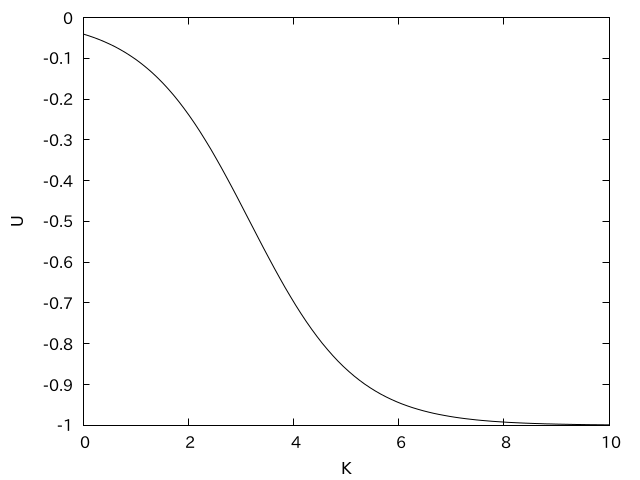
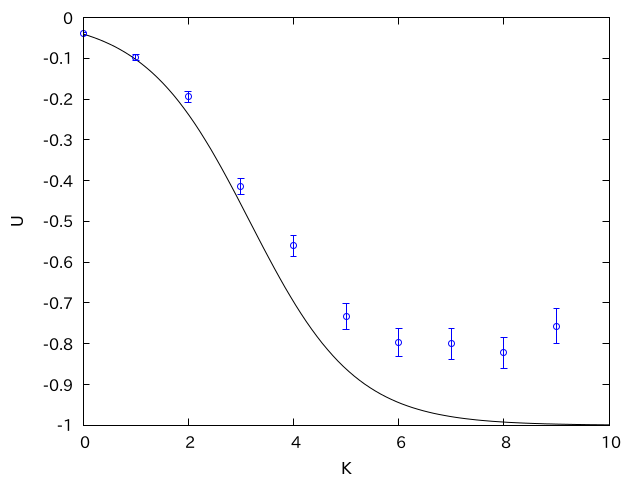
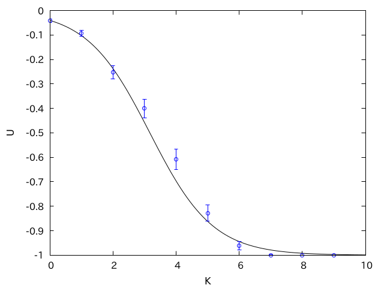

# モンテカルロ法(1)基礎的な話題

* 乱数とはなにか
* モンテカルロ法
* マルコフ連鎖モンテカルロ法

## はじめに

モンテカルロ法とは、乱数を使って何かを評価する方法だ。一般には単純なモンテカルロ法が使われることは稀で、ほとんどの場合「モンテカルロ法」と言うとマルコフ連鎖モンテカルロ法のことを指す。モンテカルロ法の原理は非常に単純であり、コードも比較的容易だ。しかし、その本質の理解はかなり難しい。以下では、乱数の説明からはじめ、モンテカルロ法とはなにか、なぜ必要なのか、何が難しいのかをなるべく平易に説明する。

## 乱数とはなにか？

まずは乱数を定義しよう。何か数列$r_i$があるとする。$r_0$から$r_i$まで既知である時に$r_{i+1}$を全く予想できない時、この数列を**乱数列(random sequence)**、乱数列のそれぞれの要素を**乱数(random number)**と呼ぶ。簡単な例はサイコロだ。$i$回目に振った時のサイコロの目を$r_i$としよう。この時、$r_i$は1から6までのどれかの値を取る。さて、いま5回サイコロを振って、「1,5,3,2,2,2」という目が出たとする。この時、7回目のサイコロの目$r_7$を予想できるだろうか？イカサマの無いサイコロであれば、$r_7$が取る値は1から6まで等確率であるから、過去の履歴を知っているからといって、値を当てる確率は増えない。このように、過去の履歴から次の値が全く予想できないため、「サイコロを振ってでてきた目の履歴」は乱数列とみなすことができる。

乱数はコンピュータでよく使われている。例えばゲームでは乱数は欠かせない。ソシャゲのガチャや、RPGの「会心の一撃」、ポケットモンスターの個体差などに乱数が使われている。コンピュータで使われる乱数は、これまでの履歴から次の数を作っているため、原理的には次の数が予想可能だ。このような乱数を**疑似乱数(pseudo random number)**と呼ぶ。数値計算で使う乱数は疑似乱数であるため、単に乱数と言うと疑似乱数のことを指す。

一方、真の意味で次の数が予想できない「本当の乱数」を「真乱数」と呼び、疑似乱数と区別することがある。真乱数は、熱雑音や、放射性物質の崩壊など、物理現象を利用して生成する。このような装置を物理乱数生成器と呼ぶ。サイコロも一種の物理乱数生成器と言える。一部のCPUには、物理乱数生成器を搭載しているものもある(例えばIntelのrdrandなど)。

疑似乱数は、一見すると乱数に見えるが、周期性があったり、十分に長い履歴を知ると次の値が予想できたりするため、たとえばセキュリティ目的などに使う場合は注意が必要だ。しかし、数値計算で使う乱数は

* 十分に周期性が長い(相関がほとんど無い)
* 出現する数に偏りがない(一様性)

という条件さえ満たされていれば、予測可能であっても問題ないことが多い。逆に、同じ乱数の種からは同じ乱数列が生成されることを積極的に利用し、乱数を使ったコードのデバッグを行う。疑似乱数を生成するアルゴリズムはいろいろあるが、現在広く使われているのはメルセンヌ・ツイスター法で、ほとんどのプログラミング言語において、乱数を生成する関数のデフォルトに選ばれている。一方、Xorshift法という、極めて高速に動作し、乱数の性質も(メルセンヌ・ツイスターには及ばないものの)非常に良い手法も提案されており、Google ChromeのJavaScriptの乱数生成関数`Math.random()`に採用されている。

疑似乱数生成アルゴリズムについては詳しくは触れないが、その性質と使い方だけ簡単に見ておこう。例えばPythonで乱数を使うには`random`を`import`してから`random.random()`を呼び出す。これは、呼び出すたびに異なる0から1までの浮動小数点数を返す関数だ。

```py
import random
for _ in range(5):
    print(random.random())
```

実行するたびに異なる値が表示される。

```sh
$ python3 rand.py
0.7183142085184294
0.625356371754038
0.8206028825940407
0.5122008096362916
0.7253633754087734

$ python3 rand.py
0.3618195051209263
0.7496549080606681
0.3396919019733251
0.9722928645993307
0.3532634875426808
```

しかし、「乱数の種」を指定すると、何度実行しても同じ数列が表示される。

```py
import random
random.seed(1)
for _ in range(5):
    print(random.random())
```

```sh
$ python3 rand.py
0.13436424411240122
0.8474337369372327
0.763774618976614
0.2550690257394217
0.49543508709194095

$ pyton3 rand.py
0.13436424411240122
0.8474337369372327
0.763774618976614
0.2550690257394217
0.49543508709194095
```

疑似乱数生成は、これまでの履歴をうまいこと使って次の数を作るアルゴリズムであるから、乱数の「種」が同じならば、履歴が同じになり、必ず同じ数列が得られる。Pythonで種を指定しなかった場合に毎回異なる数列が得られたのは、種を指定しなかった場合にシステム時刻が指定されるからだ。

一方、C++では、乱数の種を指定しなければ同じ種が使われるため、何度実行しても同じ結果になる。

```cpp
#include <iostream>
#include <random>

int main() {
  std::mt19937 mt;
  std::uniform_real_distribution<> ud(0.0, 1.0);
  for (int i = 0; i < 5; i++) {
    std::cout << ud(mt) << std::endl;
  }
}
```

```sh
$ g++ rand.cpp
$ ./a.out
0.135477
0.835009
0.968868
0.221034
0.308167

$ ./a.out
0.135477
0.835009
0.968868
0.221034
0.308167
```

このように、乱数生成にい同じアルゴリズムを使っていても、異なる言語では異なる仕様になっていたりするので注意が必要だ。

## モンテカルロ法

モンテカルロ法とは、乱数を使ってなにかの期待値を計算する手法の総称だ。数値計算において、なにかの期待値を計算したいことがよくある。しかし、興味ある系において期待値が厳密に計算できることはほとんどないため、乱数を使ったサンプリングにより期待値を求めることになる。

モンテカルロ法の例として「円周率の計算」がよく出てくる。0から1の間の一様乱数を$x$、$y$と二つ作り、その二乗和$x^2+y^2$が1より小さい確率を求めることで、それが$\pi/4$となることから円周率が求まる。

たとえばコードはこんな感じになるだろう。

```py
import random

random.seed(1)
pi = 0.0
N = 1000000
for _ in range(N):
    x = random.random()
    y = random.random()
    if x**2 + y**2 < 1.0:
        pi = pi + 1.0
pi = pi/N*4
print(pi)
```

実行結果はこうなる。

```sh
$ python3 pi.py
3.14138
```

この計算は、数式で表すなら以下の積分を実行していることに対応する。

$$
\frac{\pi}{4} = \int_0^1 \int_0^1 \Theta (1- x^2 + y^2) dx dy
$$

ここで$\Theta(x)$は、$x>0$なら$1$、$x<0$なら$0$となる関数(ヘヴィサイドの階段関数)だ。先程のコードは、サンプリングによりこの積分値を評価していることに対応する。このように、モンテカルロ法は「式は書けるけれど、厳密に評価することが難しい和や積分」の評価に使われる。

さて、ここで使われた手法は単純サンプリングと呼ばれ、効率がよくない。数値計算で使われるモンテカルロ法は、ほぼ「マルコフ連鎖モンテカルロ法」のことを指す。以下では、まず単純サンプリングで用語の説明をした後、マルコフ連鎖モンテカルロ法について説明する。

### 単純サンプリング

いま、公平なサイコロがあったとしよう。1から6までの目が書いてある。それぞれの目の出る確率が等しい時、サイコロの目の期待値はどれくらいだろうか？答えはすぐに「3.5」だとわかるが、後のために用語を定義しながらきちんと議論しておく。しばらく「当たり前」の議論が続くが、我慢してついてきて欲しい。

サイコロの目の状態に通し番号をつけ、$k$番目の状態の目の値を$Y_k$で表現する。$k$は1から6までで、$Y_k = k$だ。状態$k$が出る確率を$p_k$としよう。この時、サイコロの目の期待値$\bar{X}$は、以下のように表現できる。

$$
\bar{X} = \sum_{k=1}^6 Y_k p_k = \sum_{k=1}^6 k p_k
$$

公平なサイコロであれば、全ての目の出る確率が等しいため、$p_k$は$k$に寄らず$1/6$だ。したがって、

$$
\bar{X} = \sum_{k=1}^6 \frac{k}{6} = 3.5
$$

と期待値が厳密に計算できる。さて、サイコロが公平であることを事前に知らない、もしくは確信が持てないとしよう。すると、どの目がどれくらい出るかわからない。したがって、目として$k$が出る確率$p_k$を推定してやる必要がある。

まずは何度もサイコロを振って、$k$が出た回数を数えよう。これを$w_k$とする。サイコロを振った回数の総数$N$は、$w_k$の和で表せる。

$$
N = \sum_k w_k
$$

サイコロにおいて$k$の目がでる確率は$w_k$に比例すると考えられるから、$k$が出る確率$p_k$は、$N$と$w_k$の比として推定できる。

$$
p_i \sim \frac{w_k}{N}
$$

以上から、サイコロの目の期待値は

$$
\bar{X} = \sum_k k p_k \sim \sum_k k \frac{w_k}{N}
$$

ここで$w_k$を状態$k$の **重み(weight)** と呼ぶ。

さて、サイコロを何度も振り、$i$回目に出た目が$\hat{X}_i$だったとしよう。サイコロを$N$回振って、出た目が$k$であった回数は以下のように書ける。

$$
w_k = \sum_{i=1}^N \delta_{\hat{X}_i, k}
$$

$\delta_{\mu,\nu}$はクロネッカーのデルタで、$\mu=\nu$の時に1、そうでなければ0となるものだ。わざわざ式で書いているが、サイコロの目が出た回数を数えているだけだ。確率の問題では、このように「当たり前」のことを式で表現すると面倒な形になることが多い。

さて、$w_k$を先の式に代入しよう。

$$
\bar{X} \sim \sum_k k \frac{w_k}{N} =
\frac{1}{N} \sum_k k \sum_{i=1}^N \delta_{\hat{X}_i, k}
$$

和を入れ替える。

$$
\sum_k k \sum_{i=1}^N \delta_{\hat{X}_i, k}
= \sum_{i=1}^N \sum_k k \delta_{\hat{X}_i, k}
$$

$k\delta_{\hat{X}_i, k}$は、$\hat{X}_i = k$の時にkに、それ以外は$0$となるから、$k$に関して和を取ると、単純に$\hat{X}_i$になる。

以上から、

$$
\hat{X} \sim \frac{1}{N} \sum_{i=1}^N \hat{X}_i
$$

を得た。要するに何度もサイコロを振って、その平均を取りなさい、と言ってるだけだ。

さて、上記の議論では、サイコロの目$k$が出る時の重み$w_k$が未知だが、実際にサイコロを振ることで、サイコロの目$k$が$p_k$に従って出現することを利用していた。しかし、数値計算では、$w_k$も$p_k$も未知だが、$p_k$に従って状態$k$が出現してくれるようなシチュエーションは存在せず、状態$k$の重み$w_k$が既知だが、その総和$Z$を求めることができず、結果として$p_k$が未知である状態であることがほとんどだ。その場合にどのように期待値を推定するか見てみよう。

我々は状態$k$の重み$w_k$が既知であるが、その総和$Z$が未知であるとする。その状態で、

$$
\bar{X} = \sum_k k p_k
$$

を推定したい。

$$
p_k = \frac{w_k}{\sum_k w_k}
$$

であるから、

$$
\bar{X} = \frac{\sum_k k w_k}{\sum_k w_k}
$$

となる。まずは分母を評価することを考えよう。

$$
Z = \sum_k w_k
$$

和のままでも議論できるが、積分の方がわかりやすいので、$k$が十分に大きいとして積分だと思うことにしよう(もとがサイコロなので$k$は大きくないが、ここでは見逃してもらうことにする)。$k$の最小値、最大値をそれぞれ$k_\mathrm{min},k_\mathrm{max}$とすると、

$$
Z = \int_{k_\mathrm{min}}^{k_\mathrm{max}} w(k) dk
$$

となる。この積分を、乱数を使って評価しよう。$k_\mathrm{min} < \hat{X}_i < k_\mathrm{max}$であるような一様乱数を考える。この乱数を$N$回生成させ、その$i$番目の値を$\hat{X}_i$とする。一度出現させた乱数$\hat{X}_i$に、領域を$N$等分した範囲

$$
\Delta k \equiv \frac{k_\mathrm{max}- k_\mathrm{min}}{N}
$$

をかけて、小さい短冊の和として積分を評価してやる。すると、

$$
Z = \sum_k w_k \sim \sum_i w_{\hat{X}_i} \Delta k
$$

となる。同様に分子も、

$$
\sum_k k w_k \sim \sum_i \hat{X}_i w_{\hat{X}_i} \Delta k
$$

となる。以上から、平均値の推定値は

$$
\bar{X} = \frac{\sum_k k w_k}{\sum_k w_k}
\sim \frac{\sum_i \hat{X}_i w_{\hat{X}_i}}{\sum_i w_{\hat{X}_i}}
$$

と推定される。このように、なにかの期待値をランダムな標本を使って推定する手法を**サンプリング**と呼ぶ。特に、まずは重みに関係なく状態を一様に生成し、その後で重みをかけて平均をとる手法を **単純サンプリング**と呼ぶ。

サイコロのように、もし$w_k$が全て等しいのなら、$w_k = 1$とおいて良いから、

$$
\bar{X} = \frac{1}{N} \sum_i \hat{X}_i
$$

と、先程の式と一致する。また、前述の円周率の推定では、重みは四分円の中なら1、外なら0とした単純サンプリングになっている。

単純サンプリングについてまとめて置こう。

* 一般には、ある状態の重みは既知だが、重みの総和が求まらないために、状態の出現確率が未知であることが多い
* なにかを調べたい時に、全てを調べるのではなく、一部の標本を抜き出して調べることをサンプリングと呼ぶ
* なにかの期待値を乱数を使って評価する手法をモンテカルロ法と呼ぶ。
* 出現可能な状態を一様に選び、重みをかけて期待値を推定する手法を単純サンプリングと呼び、モンテカルロ法の最も簡単な例

### 状態数

公平なサイコロの要件は、全ての目の出現重みが等しいことだ。$w_k$はお互いの比だけが問題となるので、$w_k = 1$としよう。すると、$Z=6$、$p_k = 1/6$となる。我々が「公平なサイコロを振ったら、各目が出る確率が1/6だ」という時には、

* 各サイコロの目がでる重みは等しい $w_k = 1$
* サイコロには目の種類が6個あるので、重みの和は$Z = \sum_k w_k = 6$となる
* したがって、各目の出現確率は$p_k = w_k/Z = 1/6$となる

という論理を無意識に使っている。

さて、普通のサイコロでは、全ての目が異なっていたため、$k$番目の状態の目の値$Y_k$は$k$に等しく、単に$k$で置き換えればよかった。後の布石のために、目に重複のあるサイコロを考えてみよう。

6面に「1,2,2,3,3,3」と描かれたサイコロがあるとしよう。この6つの状態の出現頻度は等しいとする。$k$番目の状態の目の値を$Y_k$とする。つまり、
$$
Y_1 = 1, Y_2 = 2, Y_3 = 2, Y_4 = 3,Y_5 = 3,Y_6 = 3
$$
だ。もともとが公平なサイコロなので、6つの状態が等しい重み$w_i=1$を持っているとしよう。すると、このサイコロの目の期待値は

$$
\bar{X} = Z^{-1} \sum_{k=1}^6 Y_k w_k
$$

と書ける。ただし$Z = \sum_k w_k$だ。ここで、状態は6種類あるが、値は1,2,3の3種類しかないことに注目し、値について和をまとめてしまおう。いま、値$j$を取る状態の数を$g_j$とする。今回のケースでは$g_1 = 1, g_2 = 2, g_3 = 3$だ。

すると、和を値で取りなおすことができる。

$$
\bar{X} = Z^{-1} \sum_{j=1}^3 j g_j w_j
$$

となる。

ここまでの用語の整理をすると、

* 値$j$を持つ状態の重みが$w_j$
* 値$j$を持つ状態の状態数が$g_j$個である時、
* 重みの総和を$Z=\sum_j g_j w_j$として、
* 値の期待値は$Z^{-1} \sum j g_j p_j$で書ける

という、至極当たり前のことを言っているだけだ。

「値が重複するサイコロ」をもう少し深堀りしよう。今は6つの状態全ての重みが等しかったが、状態に重複があったため、「値」で和を取ると状態数がかかった。そこで$w_j g_j$を、改めて値$j$を取る状態の重み$w'_j$だと考えよう。

とり得る状態は3つ、値は$1,2,3$、重みは$w'_1 = 1, w'_2 = 2, w'_3 =3$となる。すると、期待値は

$$
\bar{X} = \frac{\sum_j k w'_k}{\sum_j w'_k}
$$

と表現できる。先程と同様に、全ての状態$j$の重み$w'_j$は既知だが、その総和が未知である時、この和を単純サンプリングで評価することを考えよう。1,2,3のいずれかの値を当確率で取る乱数を$N$個作成し、その$i$番目の値を
$\hat{X}_i$をとすると、期待値は以下のように推定できる。

$$
\bar{X} \sim \frac{\sum_i^N \hat{X}_i w'_{\hat{X}_i}}{\sum_i^N w'_{\hat{X}_i}}
$$

手続きを言葉で書くと以下の通り。

1. 1,2,3のいずれかの値を取る乱数をを作る
2. 出現した値に対応する重みに値をかけて和をとる(分子の推定)
3. 出現した値に対応する重みの和をとる(分母の推定)
4. 十分な和が取れたら、それらの比を取る

こちらのケースでは、重みが一様ではないので、分子と分母がキャンセルせず、簡単な形にならないことに注意。

## マルコフ連鎖モンテカルロ法

### 格子ガス模型

なにかランダムな値の期待値を計算したい時、その値を取る状態の出現頻度(重み)と、その値を取る状態の数(状態数)を知る必要があった。たとえば公平なサイコロの例では、重みも状態数も1であり、重複のあるサイコロでは、「重みが一様で状態数が異なる」もしくは「状態数が一様で、重みが異なる」であった。一般には、状態数も重みも一様ではなく、かつ重みの総和も状態数も厳密に求めることは難しい。以下では、サイコロより非自明で、かつ物理的にも興味深い例として気液相転移を考えよう。相転移とは、温度等を変化させた時に、ミクロな性質は変わらないにも関わらず、マクロな性質が大きく変化することだ。例えば、大気圧下において水は100度で沸騰して水蒸気になるが、ミクロにみれば水分子の性質は全く変わっていない。水分子同士の相互作用は温度に依存しないと思われるのに、温度により固体、液体、気体と、全く振る舞いが異なる状態になる。このうち、気体と液体の相転移を考えてみよう。原子が近距離で斥力、中間距離で引力、遠距離で相互作用しないという条件を満たすと気体と液体の相転移がおきる。これを非常に単純化し、格子上に原子を置く格子ガス模型を考えてみる。

$V = L x L$の正方格子を考える。この格子の上に$N$個の原子を置こう。「近距離で斥力」を表現するため、原子は一つのサイトに一つしか置けないことにする。また、「中間距離で引力」を表現するため、原子が上下左右に隣り合う場合は、$\epsilon$だけエネルギーが下がることにする。原子が上下左右に隣り合っていない時には、なんら相互作用をしないことで、遠距離で相互作用しないことを表現しよう。後の簡単のため、周期境界条件を採用する。

系は離散的であり、状態の数え上げが可能なので、全ての状態に通し番号$k$をつけよう。状態$k$のエネルギーを$E_k$とする。この状態の出現確率は、ボルツマン重み
$$
w_k = \exp(-\beta E_k)
$$
に比例するのであった。ここで、$\beta$は$k_B$はボルツマン定数、$T$は絶対温度として$\beta = 1/k_B T$で表される逆温度だ。これは、エネルギーが低い状態ほど出現しやすいことを表現している。

状態$k$の出現確率$p_k$は、重み$w_k$の総和
$$
Z = \sum_k w_k
$$
を使って
$$
p_k = \frac{w_k}{Z}
$$
と書ける。すると、ある温度におけるエネルギーの期待値は
$$
U(T) = \sum_k E_k p_k = Z^{-1} \sum_k E_k w_k
$$

と表すことができる。この$U(T)$を様々な温度$T$で計算するのが目的だ。なんとなく、温度が低い時には偏った状態(液相)となってエネルギーが下がり、温度が高いと原子がバラバラな状態(気相)になってエネルギーが上がりそうな気がする。それを確認しよう。

簡単のため、二原子系($N=2$)を考える。原子が二つなので、それが隣り合っていればエネルギーは$-\epsilon$、そうでなければ$0$と、エネルギーのとり得る値は二種類だ。それを$E_0 = -\epsilon$、$E_1 = 0$と名前をつけて、先程の「値が重複しているサイコロ」の例にならって、同じエネルギーを持つ状態で和をまとめよう。エネルギー$E_j$をとる状態の重みを$w_j$、状態数を$g_j$とすると、重みの和$Z$は

$$
\begin{aligned}
Z &= \sum_k w_k \\
&= \sum_j g_j w_j \\
&= g_0 w_0 + g_1 w_1 \\
&= g_0 \mathrm{e}^{\beta \epsilon} + g_1 \\
&= g_0 \mathrm{e}^K + g_1 \\
\end{aligned}
$$

と書ける。ただし$K=\beta \epsilon$とした。

すると、エネルギーの期待値は

$$
\begin{aligned}
U(T) &= Z^{-1} \sum_j E_j g_j w_j\\
&= \frac{E_0 g_0 w_0 +E_1 g_1 w_1}{Z} \\
&= \frac{-\epsilon g_0 \mathrm{e}^K}{g_0 \mathrm{e}^K + g_1}
\end{aligned}
$$

と書けた。以上から、エネルギーの期待値の温度依存性は、あるエネルギーを取る状態数$g_0$、$g_1$を求めることに帰着された。

いま、格子の数は$V$個なので、そこに二つ原子を置く方法は全部で$V(V-1)/2$通りだ。したがって、

$$
g_0 + g_1 = \frac{V(V-1)}{2}
$$

となる。次に$g_0$は、二つの原子が隣り合っている状態の数だ。二原子分子の位置が$V$通り、分子の方向が$2$通りなので、合わせて$2V$通りとなる。以上から、

$$
\begin{aligned}
g_0 &= 2V \\
g_1 &= \frac{V(V-5)}{2}
\end{aligned}
$$

となり、これで内部エネルギーの厳密解がわかった。$V = 10^2$、$\epsilon = 1$として、内部エネルギーを$K$の関数としてプロットすると以下のようになる。



$K=\beta \epsilon = \epsilon/k_B T$なので、$K$が小さいところが高温、大きいところが低温になる。高温(左側)でエネルギーが0となり、低温(右側)でエネルギーが$-1$に漸近しており、相転移っぽいものが見えていることがわかる。

さて、相転移は多数の自由度が集まることで起きる現象であるから、$N$を増やしたい。とりあえず次は三原子系としよう。すると、エネルギーとしてとり得る値は
$$
E_0=-2\epsilon, E_1 = -\epsilon, E_2 = 0
$$
の三種類だ。エネルギーの温度依存性を調べるためには、あるエネルギー$E_j$を取る状態の状態数$g_j$を求めなければならない。

エネルギーが$E_0$となる状態は、原子が３つつながった三原子分子となっている状態だ。３つが横並びになっているか、曲がった状態でつながっているかで場合分けすれば状態数$g_1$を求めることができる。

エネルギーが$E_1$となる状態は、三つの原子のうち、二つが二原子分子を構成し、残りがどこかにいる、という状態だ。これも頑張れば状態数$g_2$を計算できる。

$g_1$と$g_2$がわかれば、状態の総数はわかっているので$g_3$も計算できる。

では$N=4$の時は？$N=5$は？少し考えれば、$N$が増えるにつれて指数関数的に考えるべき条件が増え、一般の状態数を求めることができないことがわかるであろう。状態数$g_j$がわからないため、重みの総和$Z$も求めることができない。したがって、あるエネルギーを持つ一つの状態の出現確率も求めることができない。したがって、エネルギーの期待値を厳密に求めることができないので、モンテカルロ法によるサンプリングで求めることになる。

まずは単純サンプリングで求めることを考えよう。格子ガス模型に単純サンプリングを適用すると、以下のような手続きとなる。

1. $V$個のサイトから無作為に$N$個選び、そこに原子を置いた状態を$i$とする
2. その状態のエネルギー$E_i$を計算する
3. エネルギーから重み$w_i$を計算する
4. これを繰り返し、$\sum E_i w_i$と$\sum w_i$の比を計算する

こうして計算したエネルギーの温度依存性をプロットすると以下のようになる。



各温度$K$において、エネルギーを50回計算し、それを100サンプル取ることで誤差を推定した。$K$が大きいところ、すなわち低温で理論曲線から大きくずれていることがわかる。これは、、非常に稀に出現するエネルギーの低い状態が非常に大きな重みを持つためだ。低温、すなわち$K$が大きところでは、重み$\exp(K)$が大きくなる。しかし、エネルギーの低い状態、つまり原子が隣り合う状態数は、全体の状態数が$O(V^2)$であるのに対して$O(V)$しかない。したがって、無作為に状態を選んだ場合、原子が隣り合う状態が出現する確率は$O(1/V)$となる。小さい確率で出現する状態が大きな重みを持つため、正しい値に収束させるためには、小さい確率で出現する状態を十分な数だけ出現させなければならず、非常に大きなサンプル数が要求される。

ここまでをまとめておこう。

* 状態が与えられた時、エネルギーは計算できるため、重みもすぐにわかる
* 逆に、エネルギーが与えられた時に、そのエネルギーを持つ状態の数はわからない
* 状態数がわからないため、重みの総和も計算できず、期待値を厳密に求めることはできない
* 低温においては稀にしか出現しない状態が大きな重みを持っており、それゆえに単純サンプリングで精度がでない

## マルコフ連鎖モンテカルロ法

長々と当たり前のことを説明してきたが、ここでようやくマルコフ連鎖モンテカルロ法の説明に入ることができる。単純サンプリングの問題点は、状態によって重みに非常に差があるのにもかかわらず、重みを無視して状態を選んでいたことによる。数は少ないが重みが大きい状態と、数は非常に多いが重みが非常に小さい状態をうまいことサンプリングしてやる必要がある。

さて、もし状態$j$を、重み$w_j$に比例して選ぶことができたとしよう。これは、重みの総和を$Z = \sum_j w_j$として、状態$j$を確率$p_j$で生成することに対応する。これができたならば、

$$
U(T) = \sum_i E_i p_i \sim \frac{1}{M} \sum_j E_j
$$

と、$M$回状態$j$を生成し、状態$j$のエネルギーを計算し、そのエネルギー$E_j$の算術平均を取るだけで良い。しかし、重みの総和$Z$を計算することはできなかった。重みの総和を計算せずに、状態$j$を重み$w_j$に比例して選ぶことはできないだろうか？そんなうまい方法がマルコフ連鎖モンテカルロ法だ。

重みの総和を計算することができないため、全ての状態の集合から重みに比例して無作為に状態を選ぶことは不可能だ。しかし、ある二つの状態$i$と$j$を考えた時、$i$から$j$、$j$から$i$への遷移確率を重みに比例するように選ぶことは可能だ。こうして次々と「現在の状態」から「重みに比例して次の状態」を選んでいくと、そのうち状態が重みに比例して出現するようになる、というのがマルコフ連鎖モンテカルロ法の仕組みである。

単純サンプリングでは、全ての状態候補のなかから、無作為に状態を一つ選んでから重みを計算し、重み付きで平均を取っていた。マルコフ連鎖モンテカルロ法は、現在の状態から、似た状態を「遷移先候補」として選び、そこに遷移するかどうかを「現在の状態」と「遷移先候補」の重みで決める。

いま、二つの状態$A$と$B$があるとしよう。それぞれ重み$w(A)$、$w(B)$を持っている。この時、平衡状態における分布$\pi(A)$と$\pi(B)$が、それぞれの重みに比例するようにしたい。

あるステップにおいて、$A$から$B$に行く確率を$P(A\rightarrow B)$としよう。これは、$A$、$B$を国だと思うと、$A$の人口のうち、どれくらいが$B$に移住するかの割合を表している。同様に、$B$から$A$に行く確率を$P(B\rightarrow A)$とする。

さて、この系が平衡状態になったとする。平衡状態とは、$A$と$B$で人の行き来はあるけれど、それぞれの人口が変わらない状態だ。この時の人口が$\pi(A)$、$\pi(B)$であるから、

$$
\pi(A)P(A\rightarrow B) = \pi(B)P(B\rightarrow A) 
$$

が成り立つ。これは単に「AからBに行く人数」と「BからAに行く人数が等しい」と言っているに過ぎない。

さて、平衡状態における分布が重みに比例して欲しいのだから、

$$
\pi(A) \propto w(A), \pi(B) \propto w(B)
$$

となるように遷移確率$P(A\rightarrow B)$、$P(B\rightarrow A)$を決めたい。先ほどの式から

$$
\frac{P(A\rightarrow B)}{P(B\rightarrow A)}
= \frac{\pi(B)}{\pi(A)}
= \frac{w(B)}{w(A)}
$$

を満たすように決めればよい。この条件を満たす遷移確率の決め方は一意には決まらないので、我々が適当に決めてよい。現在、大きく分けて二種類の決め方がある。

まず、素直に遷移確率を重みに比例させる方法だ。

$$
P(A\rightarrow B) = \frac{w(B)}{w(A) + w(B)},
P(B\rightarrow A) = \frac{w(A)}{w(A) + w(B)},
$$

これを**熱浴法(heat-bath method)**と呼ぶ。

一方、どちらか大きい方の遷移確率を$1$にしてしまう、という方法もある。これは、重みの小さい状態から大きい状態へは必ず遷移、逆は確率的に遷移させる、ということを意味する。$w(A)' < w(B)$であるとすると、

$$
P(A\rightarrow B) = 1, P(B\rightarrow A) = \frac{w(A)}{w(B)}
$$

とすればよい。これを**メトロポリス法(Metropolis method)**と呼ぶ。

熱浴法、メトロポリス法、いずれも遷移確率に関する条件

$$
\frac{P(A\rightarrow B)}{P(B\rightarrow A)}
= \frac{w(B)}{w(A)}
$$

を満たしていることがわかる。この遷移確率に関する条件が、互いに遷移可能な全ての状態間で満たされている時、これを**詳細釣り合い条件 (detailed balance condition)**が満たされている、と呼ぶ。

マルコフ連鎖モンテカルロ法の手続きは以下のようになる

1. 適当な初期状態$x_0$を一つ選ぶ。
2. 現在の状態$x_0$から遷移可能な提案状態$x'$を一つ選ぶ。
3. それぞれの状態の重み$w(x_0), w(x')$より、遷移確率を決める
4. 遷移確率を使って、遷移させるかどうか決める
5. 遷移しなかった場合は$x_1 = x_0$、遷移した場合は$x_1 = x'$とする
6. 以下、同様な手続きを繰り返し、$x_t$から$x_{t+1}$を生成する。

十分に緩和した場合、状態$x_t$が、その重み$w(x_t)$に比例して出現するようになる。なお、遷移させるかどうか決めることを試行(trial)、提案状態に遷移することを採択(accept)、遷移しなかった場合を棄却(reject)と呼ぶ。

以上の手続きを格子ガス模型に適用しよう。考えるのは、現在の状態から遷移可能な「次の状態」をどのように選ぶか、ということだけだ。様々な方法があるが、例えば

1. 現在の状態$x_t$の中で、適当な原子を一つ選ぶ
2. その原子を動かす方向を上下左右から一つ選び、動かした後の状態を提案状態$x'$とする

という手続きとしよう。選んだ原子の移動先に原子がいなかった場合、二つの状態のエネルギー$E(x_t)$と$E(x')$から重み$w(x_t)$と$w(x')$を決め、遷移させるかどうか決めればよい。また、移動先に原子がいた場合は必ずその試行は棄却される。これは、一つのセルに二つ原子がはいったらエネルギーが無限大になる、ということを意味する。もし原子の移動先に原子があれば、提案状態$x'$のエネルギー$E(x')$は無限大なので、重み$w(x')=0$となり、そこには遷移できないからだ。

このようにすると、例えば高温では原子が自由に動き回り、低温では原子がくっつく状態への遷移確率が高く、隣接している原子が離れる確率は低くなるため、なるべく原子がくっついた状態を多くサンプリングすることになる。

以上を実装した結果を以下に示す。



条件は単純サンプリングと同じだ。低温でエネルギーの期待値を正しく計算できていることがわかる。

最後に、「マルコフ連鎖モンテカルロ法」の名前に含まれる「マルコフ性」について説明しておこう。現在の状態が$x_t$である時、提案状態への遷移確率$P(x_t \rightarrow x')$は、$x_t$のみで決まり、どのような履歴により$x_t$に到達したかは無関係だ。このように、遷移確率が現在の状態にのみ依存し、履歴に依存しない性質を**マルコフ性 (Markov property)**と呼ぶ。

マルコフ性を持つ遷移確率を用いて、次々と状態を連鎖的に生成することをマルコフ連鎖と呼ぶ。このマルコフ連鎖を用いてモンテカルロサンプリングするかマルコフ連鎖モンテカルロ法と呼ばれる。

## まとめ

マルコフ連鎖モンテカルロ法とは、現在の状態から、重みに比例するように提案状態を生成することで、効率良くサンプリングする手法だ。なぜマルコフ連鎖モンテカルロ法が必要かというと、それは重みの総和が計算できないためで、なぜ重みの総和が計算できないかというと、状態数が計算できないからだ。この、「状態からエネルギーの計算は簡単だが、エネルギーに対応する状態数の計算んが困難である」ためにモンテカルロ法が必要である、ということは覚えておいて欲しい。