# モンテカルロ法(2) 誤差解析と不偏推定量

* エラーバーについて
* 不偏推定量とJackknife法

## エラーバー

### エラーバーとは

実験において、まったく同じ条件下でも、観測するたびに結果が揺らぐ。そこで何度も観測し、「その観測値がどの程度確からしいか」を推定する。たとえば、ある回路の電流を6回測定し、$1.16, 1.13, 1.12, 1.12, 1.11, 1.08$という値が得られたとしよう(単位はmA)。この回路の電流の測定値は、平均値と「平均値の標準偏差」を使って

$$
1.12 \pm 0.01 \quad mA
$$

と書くように習ったかと思う。これを見ると、大雑把に「1.1 までは自信があるが、1.12 の値はあまり自信がなく、1.11かもしれないし、1.13かもしれない」ということがわかる。そこで、グラフでは$1.12$のところにシンボルを置き、$1.11$から$1.13$まで棒を描画して、「観測範囲はこの範囲にありそうだよ」ということを表現する。そのことから$\pm$記号の後の数値を「エラーバー」と呼ぶ。

このエラーバーを、単に「観測データの自信度である」と解釈し、「小さければ小さいほどよい」と思ってしまう人がいる。しかし、エラーバーの役割は「観測データの自信度」にとどまらず、様々な役割を持っている。以下では、エラーバーとは何か、どのような性質を持っているかを解説する。

まず、エラーバーを定義しよう。観測するたびに値が変化する観測量を確率変数$\hat{X}$とする。これを$N$回観測し、$i$番目の観測データを$X_i$としよう。確率変数$\hat{X}$の平均値$\bar{X}$と分散$\sigma^2$は以下のように与えられる。

$$
\bar{X} = \frac{1}{N} \sum_i X_i
$$

$$
\sigma^2 = \frac{1}{N-1} \sum_i (X_i - \bar{X})^2
$$

この式の意味を考えよう。確率変数$\hat{X}$について、無限回観測したとして、その観測値の集合を　**母集団(population)** と呼ぶ。観測とは、母集団から有限個の要素を取り出すことであり、個々の要素を標本と呼ぶ。$N$回観測して得られた$N$個の集合$X_i$が標本である。我々の目的は、この標本から、様々な統計的な量を推定することだ。例えば先程求めた平均値$E[\hat{X}]$や分散$V[\hat{X}]$は、母集団を特徴づける特徴量である。このように、特徴量を標本$\{X_i\}$から推定することを **統計的推定(statistical estimation)** 、もしくは単に推定と呼ぶ。そして、標本から特徴量を推定する関数ことを **推定量(estimator)** と呼ぶ。数値計算ではestimatorと呼ぶことが多いので、以下では「推定量」と呼ばずにestimatorで統一する。先ほどの式では、左辺が特徴量、右辺がestimatorである。

さて、確率変数の平均値$\bar{X}$もまた確率変数となるが、その分布は、標本数が増えればガウス分布へと近づいていく(中心極限定理)。我々が推定したいのは、確率変数$\hat{X}$が従う母集団の分布ではなく、「平均値が従う分布」であり、その特徴量である。

まず、我々が知りたい母集団とは何かを定義しておこう。確率変数$\hat{X}$の取る値が、ある実数$a$と$b$の間にある確率が以下のような積分で表されるとする。

$$
P(a < \hat{X} < b) = \int_a^b f(x)dx
$$

この時、関数$f(x)$を **確率密度関数(probability distribution function, PDF)** と呼ぶ。我々が知りたい「母集団の分布」とは、この確率密度関数のことだ。特に知りたいのは、この関数の1次と2次のモーメント、$\mu$と$\sigma^2$である。

$$
\mu = \int x f(x) dx
$$

$$
\sigma^2 = \int (x-\mu)^2 f(x) dx
$$

この量を$N$個の標本$X_i$から求めたい。

まず、$N$個の標本$X_i$から、「平均値が従う分布」の平均値と分散のesitomatorは以下のように与えられる。

$$
\bar{X} = \frac{1}{N}\sum_i X_i
$$

$$
V[\bar{X}] = \frac{1}{N(N-1)} \sum_i (X_i-\bar{X})^2
$$

期待値のestimatorは母集団のものと同じだが、分散は$1/N$となる。また、$\hat{X}$の母集団は正規分布とは限らないが、$N$が大きい時、$\bar{X}$の従う分布は正規分布に近づいていく。それを見てみよう。

例によって「公平なサイコロ」を考える。サイコロを振った後出てくる目を確率変数$\hat{X}$とみなそう。$\hat{X}$がとり得る値は$1,2,3,4,5,6$の6種類で、それぞれ出現確率は等しく$1/6$だ。したがって、その母集団は以下のような分布になる。

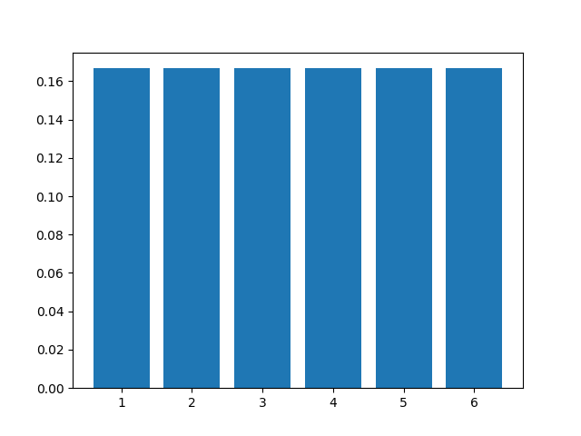

サイコロを二つ振った時の平均はどうなるだろう？サイコロの出る目の集団は$(1,1)$から$(6,6)$まで36通りだが、目の平均は$1$から$6$まで11通りだ。分布を見てみよう。

```py
from matplotlib import pyplot as plt
import numpy as np
import itertools
x = np.arange(1,7)
p= itertools.product(x, x)
plt.hist([sum(t)/len(t) for t in p])
```

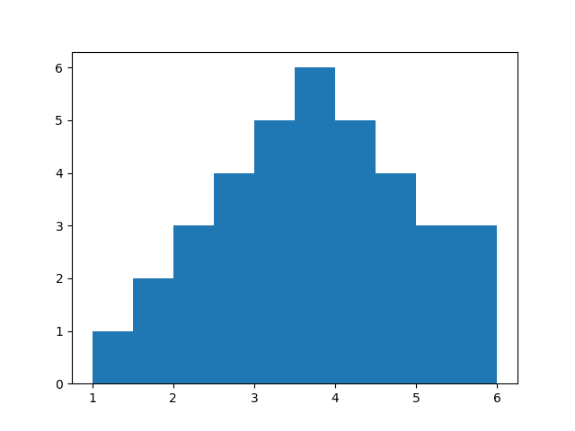

サイコロに4回振った場合、出る目の集団は$(1,1,1,1)$から$(6,6,6,6)$まで$6^4 = 1296$通りだが、その平均は$1$から$6$まで21通りとなる。分布はこうなる。

```py
from matplotlib import pyplot as plt
import numpy as np
import itertools
x = np.arange(1,7)
p= itertools.product(x, x, x, x)
plt.hist([sum(t)/len(t) for t in p])
```

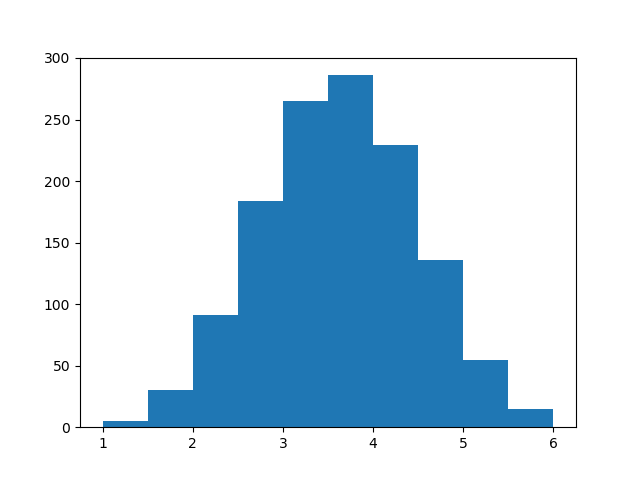

これ以上は厳密にやると大変なので、サンプリングで分布を推定しよう。


```py
n = 20000
a = []
for _ in range(n):
    xi = np.average(np.random.randint(1,7,1000))
    a.append(xi)
plt.hist(a,bins=40)
```

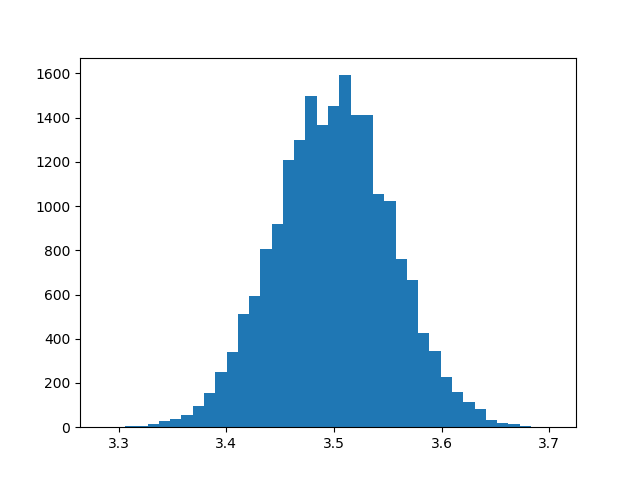

平均を取る数$N$が$10,100,1000$のそれぞれの場合を重ねてプロットするとこうなる。

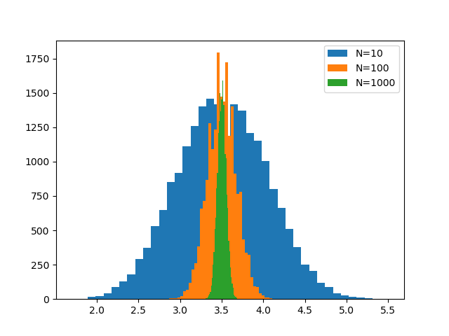

それぞれサイコロを$N$回振って平均を取る処理を20000回繰り返してヒストグラムをとったものだ。
$N$が大きくなるほど分布が狭くなっていくのがわかる。すなわち、標本の数が増えるほど、「平均値の母集団」の分布の分散は小さくなり、正規分布へと近づいていく。

平均$\mu$、分散$\sigma^2$の正規分布は以下の式で表される。

$$
f(x) = \frac{1}{\sqrt{2\pi\sigma^2}} \exp\left(-\frac{(x-\mu)^2}{2\sigma^2} \right)
$$

さて、確率密度関数の定義は、確率変数$\hat{X}$の値がある範囲$a < \hat{X} < b$にある確率が、その範囲における確率密度関数の積分で与えられる、というものであった。したがって、平均$\mu$、分散$\sigma^2$の正規分布に従う確率変数$\hat{X}$が、平均の前後$\sigma$の範囲に収まる確率は

$$
P(\mu - \sigma < \hat{X} < \mu + \sigma) = \frac{1}{\sqrt{2\pi\sigma^2}} \int_{\mu - \sigma}^{\mu + \sigma} \exp\left(\frac{(x-\mu)^2}{2\sigma^2} \right) dx \sim 0.6827
$$

で与えられる。これを **1シグマの範囲** と呼ぶ。確率変数が正規分布に従う時、1シグマの範囲に入る確率は68.27%である。平均を50、標準偏差を10とするようにスケールした時の値が偏差値であるから、これは「偏差値40から60の間にいるのは全体の68.27%である」ということを意味する。逆に、偏差値40以下、もしくは60以上の人は31.73%であるから、偏差値60以上の人は15.87%ほどいることになる。

同様に、平均の前後$n \sigma$に収まる範囲を「nシグマの範囲」と呼ぶ。2シグマの範囲に入る確率、すなわち、偏差値30から70の間に入る確率が95.45%である。簡単にまとめて置こう。

* 1シグマ：入る確率 68.27% 　 外れる確率 31.73%
* 2シグマ：入る確率 95.45% 　 外れる確率 4.55%
* 3シグマ：入る確率 99.73% 　 外れる確率 0.27%
* 5シグマ：入る確率 99.9994%  外れる確率 0.0005%

ここまでまとめておこう。

* エラーバーとは観測値を確率変数とみなした時に、その平均値の分布の推定標準偏差のこと
* サンプル数を増やせば増やすほど、エラーバーは小さくなる
* 観測値が独立同分布なら、サンプル数を増やしていくと平均値の分布はガウス分布に漸近する
* 平均$\mu$、分散$\sigma^2$のガウス分布に従う確率変数$\hat{X}$について、$\mu - n \sigma < \hat{X} < \mu + n \sigma$をnシグマの範囲と呼ぶ。
* ガウス分布に従う確率変数が独立であるならば
    * 「1シグマの範囲」からは3つに1つは外れる
    * 「5シグマの範囲」から外れる確率はほぼゼロ

### エラーバーがおかしなグラフ

エラーバーつきの期待値は、もしデータが無相関でガウス分布に従うのであれば、以下の性質を持つ。

* 「真の値」の上下に均等にばらつく
* 3つに1つは「真の値」がエラーバーの範囲に入らない
* 「真の値」がエラーバーの2倍離れることは稀、5倍離れることはない。

観測量について「真の値」を定義するのは難しく、その言葉の使用は本来気を付けるべきではあるが、ここでは便宜上、「観測量を確率変数とみなした時の母集団の分布の平均」のことを「真の値」と呼ぶことにする。

エラーバーの意味は「おおむねこのあたりに値があると思うが、エラーバーの範囲くらいで自信がないよ」ということなので、「小さければ小さいほど良い」と思う人がいる。そういう側面もあるが、エラーバーにはもっと重要な役割がある。それはデータの異常検知だ。エラーバーが適切についていればデータを見て「ん？おかしいぞ」と気づくことができる。以下、エラーバーがおかしいグラフについて実例を見ながら、「何がおかしいか」を確認しておこう。

#### エラーバーが大きすぎるグラフ

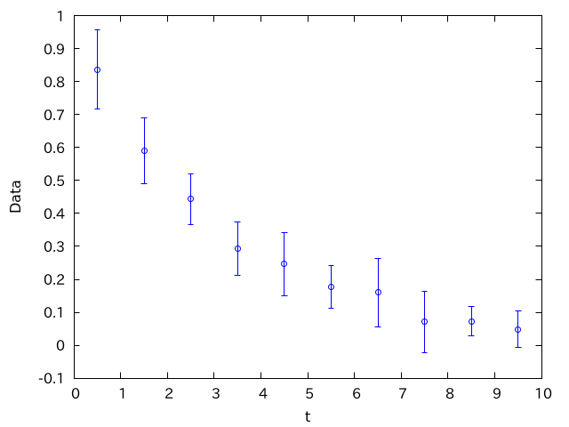

何かが指数関数的に減衰しているように見える。このグラフに「ありそうな線」を重ねてみよう。

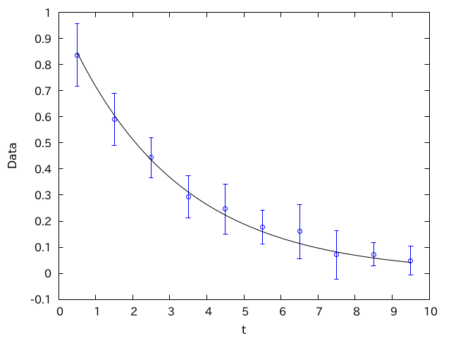

この「ありそうな線」は、「データの精度を高くしていったときに収束するであろう線」、すなわち「真の値」だ。もちろん「真の値」はわからないが、データから「だいたいこのあたりだろう」ということは推定できる。

さて、もしこのエラーバーが1シグマの範囲で取られており、かつデータが独立なガウス分布に従うのなら、3つに1つは「真の値」から外れなければならない。にもかかわらず、全てのエラーバーが「ありそうな線」にかかってしまっており、慣れていればここで「変だな」と気づく。

このデータは以下のコードで生成されたものだ。

```py
import numpy as np

N = 10
np.random.seed(1)
for i in range(10):
    x = i + 0.5
    d = np.zeros(N)
    d += np.exp(-x/3)
    d += np.random.randn(N)*0.1
    y = np.average(d)
    e = np.std(d)
    print(f"{x} {y} {e}")
```

ここで、`numpy.std`で標準偏差を求めており、それをそのままエラーバーのデータとして使ってしまっている。初心者がよくやるミスだ。正しくは$\sqrt{N}$で割ってやらないといけない。

```py
import numpy as np

N = 10
np.random.seed(1)
for i in range(10):
    x = i + 0.5
    d = np.zeros(N)
    d += np.exp(-x/3)
    d += np.random.randn(N)*0.1
    y = np.average(d)
    e = np.std(d)/np.sqrt(N)
    print(f"{x} {y} {e}")
```

こうして生成されたデータからグラフを作成すると以下のようになる。

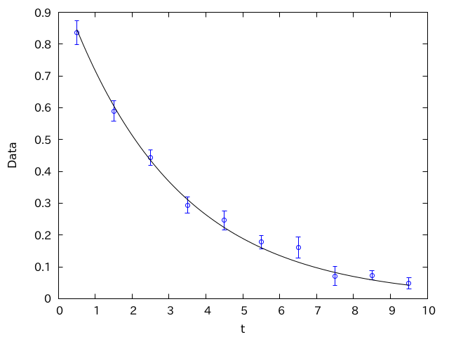

このグラフでは10個のうち少なくとも一つはデータが外れており、他にもエラーバーギリギリのデータ点もあるため、さほど不自然には見えない。

#### 偏っているグラフ

ある観測値について、サンプル数を増やすことで期待値が「真の値」に収束し、かつエラーバーが小さくなることを確認する目的で、以下のようなグラフを作ったとする。

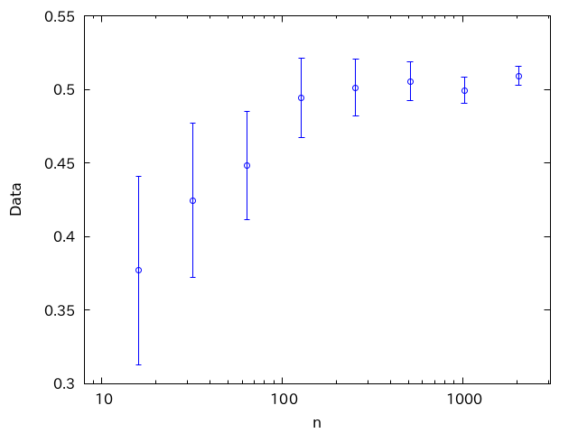

どうやらサンプル数が多い極限で0.5に収束しそうなデータであることがわかる。なので0.5の線をひいてみよう。

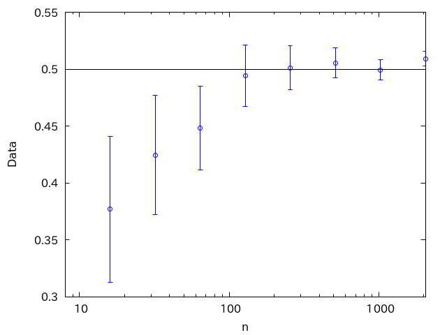

もし各データ点が独立であるなら、「真の値」の両側に均等にばらつくはずだ。しかし、このグラフでは最初の3点が「同じ側」に外れている。

このデータは以下のコードで生成されたものだ。

```py
import numpy as np

np.random.seed(1)
N = 2048
d = np.random.random(N)
for i in range(4, 12):
    n = 2**i
    dd = d[:n]
    ave = np.average(dd)
    err = np.std(dd)/np.sqrt(n)
    print(f"{n} {ave} {err}")
```

これでは異なるデータ点が同じデータを使用しているため、データ点が独立ではなくなる。

データ点ごとに独立なデータを利用するように修正したコードは以下の通り。

```py
import numpy as np

np.random.seed(1)
N = 2048
for i in range(4, 12):
    n = 2**i
    dd = np.random.random(n)
    ave = np.average(dd)
    err = np.std(dd)/np.sqrt(n)
    print(f"{n} {ave} {err}")
```

このコードが生成したデータのグラフは以下の通り。

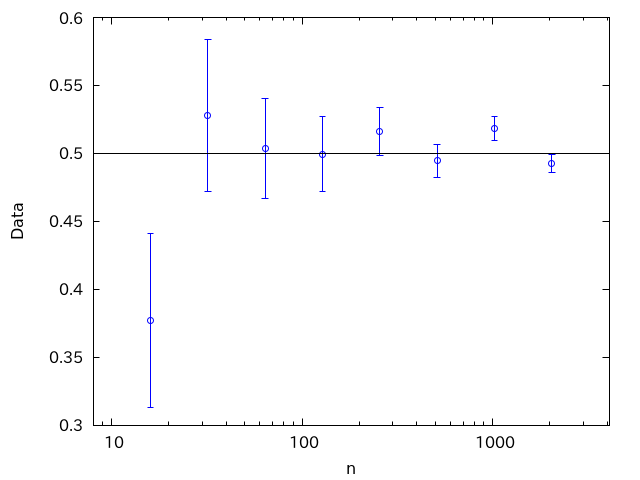

こちらではデータが「真の値」の両側にばらついており、もっともらしい。

#### エラーバーが小さすぎるグラフ

以下のグラフを見てみよう。ある物体の速度$v$の時間発展を追ったものだ。

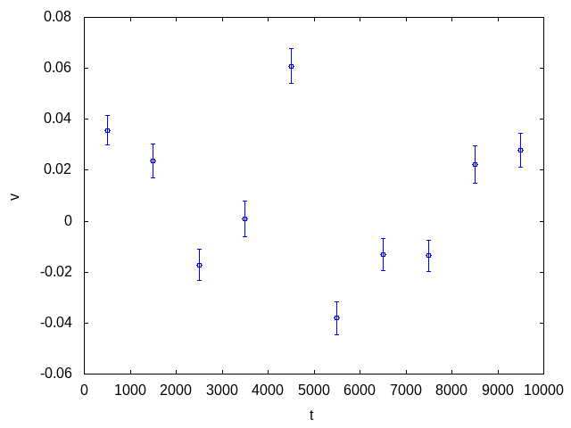

よほど複雑な振る舞いをするグラフでなければ、0のまわりを揺らいでいるように見える。$v=0$に線をひいてみよう。

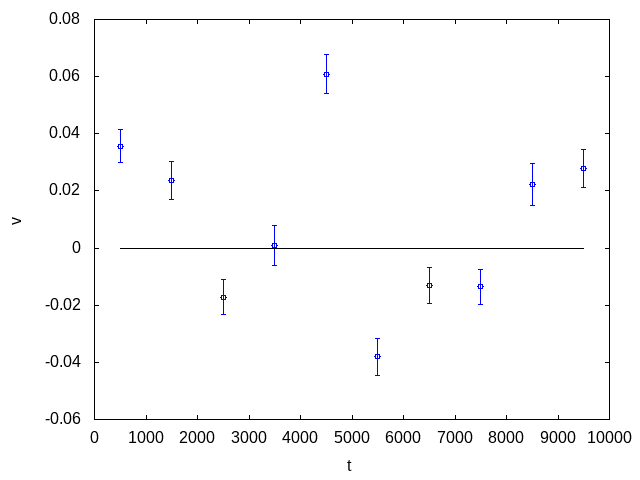

ひいた線からデータが離れすぎている。あきらかにエラーバーの大きさの5倍以上、すなわち5シグマ以上離れている。もしデータが独立なガウス分布に従うのであれば、5シグマ離れる確率は0.0005%、つまり20万点に1つあるかないかのはずだ。したがって、このグラフはエラーバーが小さすぎる。

実はこのグラフは、ランジュバン方程式のシミュレーション結果をグラフ化したものだ。ランジュバン方程式は、水中のコロイドなどの物体が水分子の衝突をうけて揺らぐ振る舞いをモデル化したもので、その運動方程式は以下のようにかける。

$$
m\frac{dv}{dt} = -\gamma v + \hat{R}
$$

これをシミュレーションするコードは以下の通り。

```py
import numpy as np

N = 1000
v = 0.0
gamma = 0.1
np.random.seed(1)

for j in range(10):
    d = np.zeros(N)
    for i in range(N):
        v += np.random.randn()*0.1
        v -= gamma * v
        d[i] = v
    ave = np.average(d)
    err = np.std(d) / np.sqrt(N)
    print(f"{(j+0.5)*N} {ave} {err}")
```

時間発展を1000ステップごとにまとめて平均とエラーバーを求めている。1000ステップごとにまとめず、生の時間発展をプロットするとこうなる。

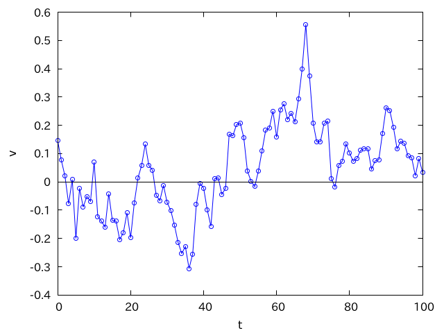

不規則な動きをしているが、一度大きく正の速度を持つと、その動きを忘れるまでにしばらくかかるのがわかる。

そこで、例えば100ステップに一度観測することにして、それを1000回繰り返して平均とエラーバーを求めてみよう。

```py
import numpy as np

N = 1000
v = 0.0
gamma = 0.1
np.random.seed(1)

for j in range(10):
    d = np.zeros(N)
    for i in range(N):
        for _ in range(100):
            v += np.random.randn()*0.1
            v -= gamma * v
        d[i] = v
    ave = np.average(d)
    err = np.std(d) / np.sqrt(N)
    print(f"{(j+0.5)*N} {ave} {err}")
```

結果は以下のようになる。

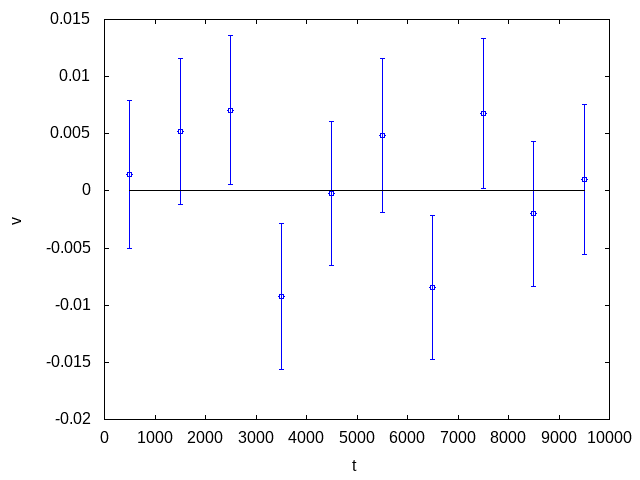

データのばらつき具合も、エラーバーの外れ具合もまともであることがわかる。

### エラーバーがおかしいグラフのまとめ

データがガウス分布に従い、かつ独立であるとき、エラーバーを1シグマの範囲にとると、観測値は以下の性質を持つのであった。

* 観測値は「真の値」の上下に均等にばらつく
* 観測値の3つに1つが「真の値」の1シグマの範囲に入らない
* 観測値と「真の値」がエラーバーの2倍離れることは稀、5倍離れることはまずない

逆に

* 観測値の全てが「真の値」をエラーバーの範囲に含む
* 「真の値」の片側に連続してずれている
* 「真の値」と5シグマ以上離れている
であるなら、何かがおかしい

というグラフは何かがおかしい。$\sqrt{N}$での割り忘れなどもあるが、データの相関が原因となることが多い。このように、適切にエラーバーをつけることで怪しいデータを発見できることがある。

## 不偏推定量とJackknife法

突然だが、$M$個の観測データ$X_1, X_2, \cdots, X_M$があるとしよう。このデータを$N$個ずつのブロックに分けて、それぞれのブロックで平均を計算し、$i$番目のブロックの平均を$\mu_i$とする。

$$
\mu_i = \frac{1}{N}\sum_{k \in i} X_k
$$

$\mu_i$は$M/N$個できるが、改めてその平均$\left< \mu\right>$を計算しよう。

$$
\left< \mu \right> = \frac{N}{M} \sum_i^{M/N} \mu_i
$$

ブロックサイズ$N$をいろいろ変えた時、$\left< \mu\right>$は$N$依存性を持つだろうか？

代入するとすぐにわかるように、

$$
\begin{aligned}
\left< \mu \right> &= \frac{N}{M} \sum_i^{M/N} \mu_i \\
&=  \frac{N}{M} \sum_i^{M/N} \left(\frac{1}{N}\sum_{k \in i} X_k \right)\\
&= \frac{1}{M} \sum_{j}^{M} X_j
\end{aligned}
$$

と、$N$に依らずに全てのデータにたいする算術平均になるため、$\left< \mu \right>$は$N$依存性を持たない。

では次に、$N$個ずつのブロックで平均値$\mu_i$を計算し、その逆数の期待値$\left<1/\mu\right>$を計算してみよう。

$$
\left< 1/\mu \right> = \frac{N}{M} \sum_i^{M/N} \frac{1}{\mu_i}
$$

この量$\left< 1/\mu \right>$は$N$依存性を持つだろうか？

実際にサイコロで試してみよう。サイコロの目の期待値は$7/2$であるから、その逆数は$7/2 \sim0.286$だ。これを数値シミュレーションで確認しよう。

まずサイコロをM回振り、それをM個ずつまとめて平均すると、ブロックごとの平均$\mu_i$が$M/N$個できる。それについて逆数の平均をとる。$M=65536$とし、$N=4,8,16,32,64,128$として$\left< 1/\mu\right>$をそれぞれ計算するコードは以下のように書ける。

```py
import numpy as np

np.random.seed(1)
N = 2**16
a = np.random.randint(1, 7, (N))


def calc(m):
    b = int(N / m)
    z = np.zeros(b)
    for i in range(b):
        z[i] = np.average(a[i * m:(i + 1) * m])
    z = 1.0 / z
    ave = np.average(z)
    err = np.std(z) / np.sqrt(len(z))
    print(f"{m} {ave} {err}")


for m in [4, 8, 16, 32, 64, 128]:
    calc(m)
```

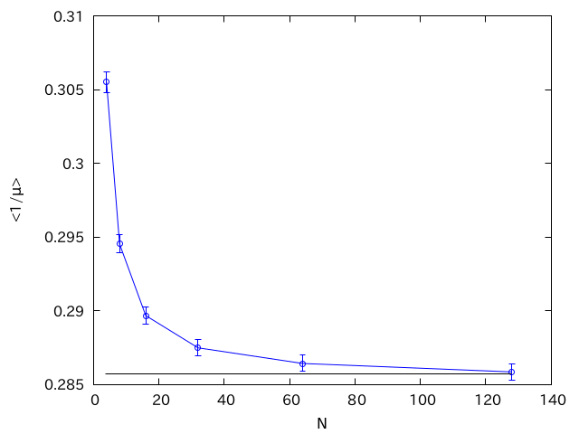

$N$が小さいところで、理論値から大きくずれているが、$N$が大きくなるにつれて理論値である$2/7$に近づいていく。$N$が小さいところでもエラーバーは小さく、この誤差は偶然によるものではないことがわかる。

この、偶然の揺らぎに起因する誤差を **統計誤差(statistical error)** 、そうでない誤差を **系統誤差(systematic error)** と呼んで区別する。なお、近年では統計誤差を **不確かさ(uncertainty)**、系統誤差を単に **誤差(error)** と呼ぶようになったようだが、本講義では統計誤差、系統誤差の用語を用いる。

この系統誤差はなぜ生じるか、どうやって消すかを知るのがこの節の目的だ。

まず、先ほどのサイコロの例の系統誤差は、期待値の関数を、関数の期待値で評価しようとしたために生じたものだ。

まずは一般論から入ろう。ある確率変数$\hat{X}$の期待値を$\mu$とする。この$\mu$の関数$g(\mu)$を推定したい。まずは$N$回測定して得られたデータ$X_i$から、期待値の推定量$\hat{\mu}_N$を求める。

$$
\hat{\mu}_N = \frac{1}{N} \sum_i X_i
$$

この推定値も確率変数だ。明らかにこの推定値の期待値は期待値に一致する。

$$
\left< \hat{\mu}_N \right> = \mu
$$

しかし、「推定値の関数の期待値」は「期待値の関数」と一致しない。

$$
\left< g(\hat{\mu}_N) \right> \neq g(\mu)
$$

これは、一般に確率変数$\hat{X}$について、関数の期待値と期待値の関数は一致しないからだ。

$$
\left< g(\hat{X})\right> \neq g\left(\left<\hat{X} \right>\right)
$$

TODO: Jensenの不等式の説明

この系統誤差の$N$依存性を調べよう。$N$回の測定で得られた期待値の推定量$\hat{\mu}_N$について、真の期待値とのずれを考える。

$$
\varepsilon = \hat{\mu}_N - \mu
$$

サンプル数を増やすとずれは小さくなるから、この$\varepsilon$は微小量とみなせる。

推定値の関数と期待値の関数の差をテイラー展開すると、

$$
\begin{aligned}
g(\hat{\mu}_N) - g(\mu) &= g(\mu + \varepsilon) - g(\mu)  \\
&= g'(\mu)\varepsilon + \frac{1}{2}g''(\mu) \varepsilon^2 + O(\varepsilon^3)
\end{aligned}
$$

両辺の期待値を取ると、

$$
\left<g(\hat{\mu}_N) - g(\mu) \right>
\sim \frac{1}{2}g''(\mu) \left< \varepsilon^2\right>
=  \frac{g''(\mu)\sigma^2}{2N}
$$

つまり、$N$個のサンプルから推定した期待値$\hat{\mu}_N$の関数$g(\hat{\mu}_N)$と、期待値の関数$g(\mu)$のずれは、$1/N$に比例する。これを **1/Nバイアス**と呼ぶ。

なお、比例係数に$g(x)$の二階微分が現れるため、二階微分がゼロである場合にはバイアスは生じない。特に$g(x)=x$の場合には、期待値の推定値の期待値は期待値に一致する。

$$
\left<\hat{\mu}_N\right> = \mu
$$

TODO: Jackknifeの説明
